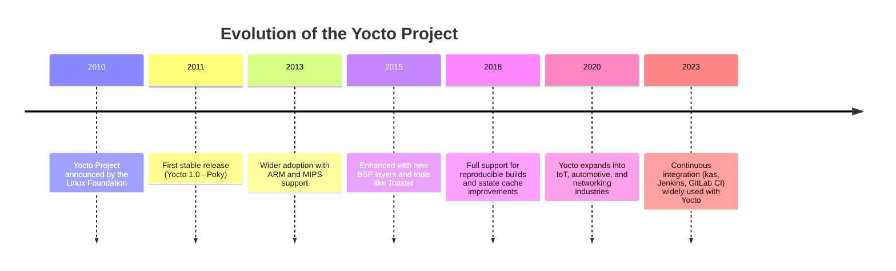
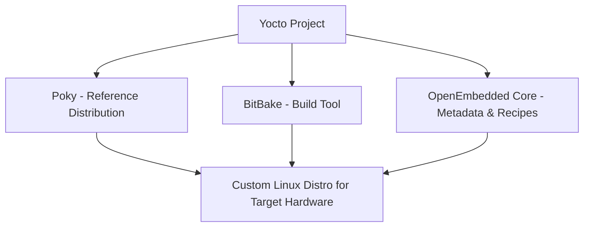

# 1. Introduction to Yocto

## 1.1 What is the Yocto Project?

The **Yocto Project** is an open-source collaboration project that provides tools, templates, and methods to create **custom Linux-based systems** for embedded devices.  
It is not a Linux distribution itself, but rather a **framework** that allows developers to build their own distribution tailored to specific hardware and use cases.  

Key components of Yocto include:  
- **Poky** – the reference build system (meta-distribution).  
- **BitBake** – the task executor and build tool.  
- **OpenEmbedded (OE) Core** – the collection of metadata, recipes, and classes.  

In simple terms: *Yocto gives you the tools to build a Linux OS from scratch for your hardware.*  

## 1.2 History and Evolution of Yocto

### Visual Timeline

- **2010**: The Yocto Project was announced by the Linux Foundation.  
- It was built on top of the **OpenEmbedded (OE)** build framework.  
- Over the years, it evolved to support **cross-compilation**, **multi-architecture builds**, and **layer-based customization**.  
- Today, Yocto is widely adopted in **embedded systems development** due to its flexibility and strong community support.  

## 1.3 Why Use Yocto Instead of Ubuntu/Debian?

Unlike general-purpose distributions (e.g., **Ubuntu** or **Debian**), Yocto is designed for **embedded systems** where size, performance, and customization are critical.  

**Key differences:**  
- ✅ **Customizability** – Build an OS with only the components you need.  
- ✅ **Reproducibility** – Exact same build across machines using BitBake and sstate cache.  
- ✅ **Cross-Compilation** – Build for ARM, MIPS, PowerPC, RISC-V, etc. from your x86 host.  
- ✅ **Small Footprint** – Generate images as small as a few MBs.  
- ✅ **Long-Term Support** – Define specific kernel versions, libraries, and patches.  

In short: Yocto is ideal for **product development**, not just running Linux on a desktop.  

## 1.4 Real-World Applications

The Yocto Project is used in many industries where **embedded Linux** is required:  

- **IoT (Internet of Things)**  
  - Smart home devices, gateways, and edge computing nodes.  

- **Automotive**  
  - In-Vehicle Infotainment (IVI) systems, ADAS (Advanced Driver Assistance Systems).  

- **Networking & Telecom**  
  - Routers, switches, and 5G equipment.  

- **Aerospace & Industrial**  
  - Robotics, drones, and mission-critical control systems.  

## 1.5 Yocto Ecosystem Diagram

✅ **Summary:**  
The Yocto Project is a powerful framework for building custom Linux distributions.  
It differs from mainstream distros by offering **control, reproducibility, and flexibility**, making it the backbone of **embedded Linux development** worldwide.  
