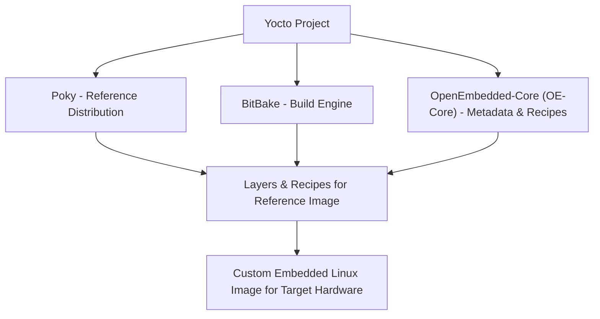
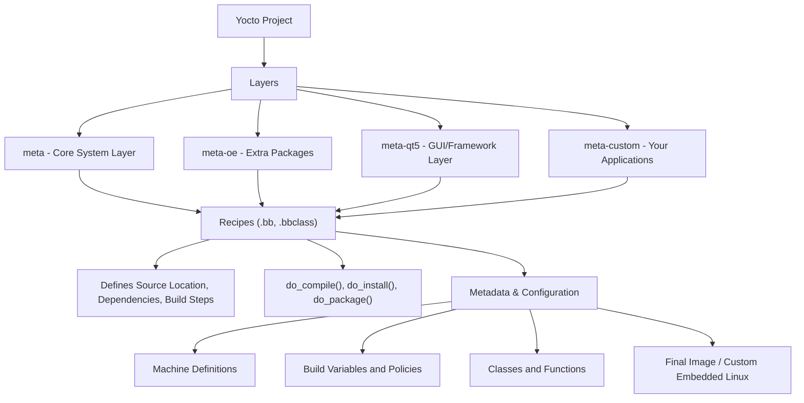
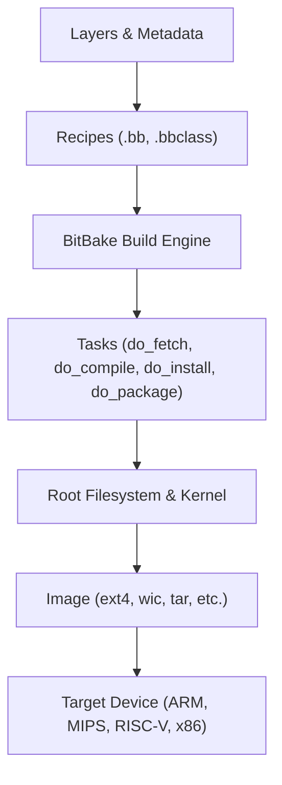
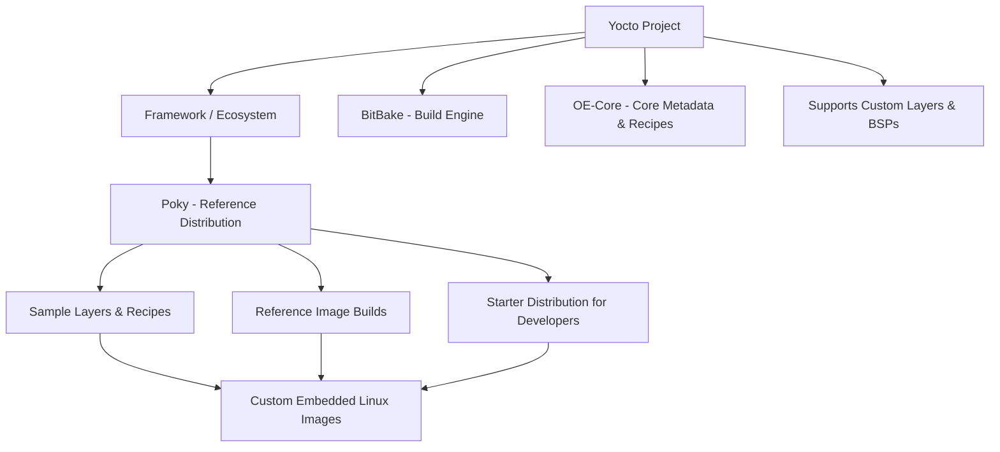
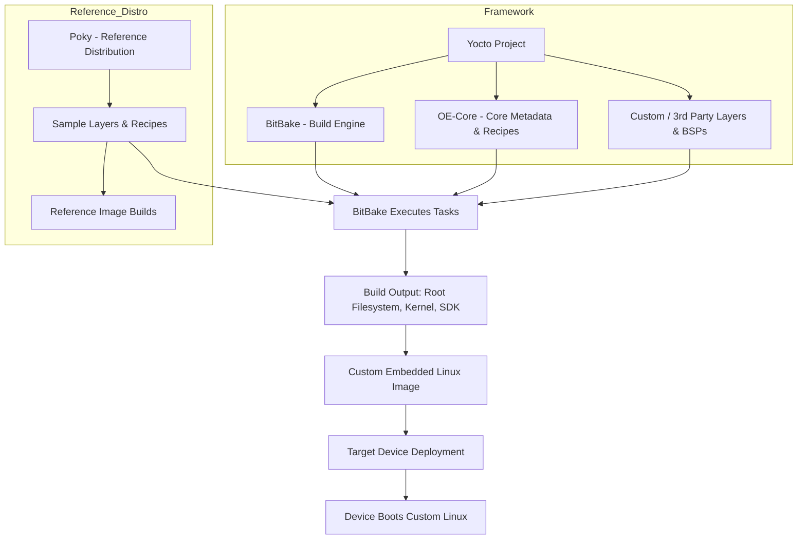

# 2. Yocto Basics

In this chapter, we explore the fundamental building blocks of the Yocto Project — including its core components, concepts like layers and recipes, types of images you can build, and how cross-compilation makes Yocto ideal for embedded development.


## 2.1 Yocto, Poky, BitBake, and OpenEmbedded: What’s the Difference?

One of the most common points of confusion for beginners is understanding the different terms used in the Yocto ecosystem. Here’s how they differ and work together:

| Component | Description | Role |
|----------|------------|------|
| **Yocto Project** | An open-source project hosted by the Linux Foundation for creating custom embedded Linux distributions. | The umbrella project that brings everything together. |
| **Poky** | The default reference distribution provided by the Yocto Project. It combines **BitBake**, **OpenEmbedded-Core**, and basic layers. | A working example of a Yocto-based Linux distro. |
| **BitBake** | The task executor and build engine. It parses recipes, resolves dependencies, and builds software. | Think of it as the "make" for Yocto. |
| **OpenEmbedded-Core (OE-Core)** | A core set of metadata, classes, and recipes used by Yocto. | Provides the foundation layers and recipes. |

✅ **Summary:**  
- **Yocto** = Project  
- **Poky** = Reference Distro  
- **BitBake** = Build Tool  
- **OpenEmbedded-Core** = Core Metadata  

### Yocto Project Ecosystem Diagram


### **Explanation of the Flow**

1. **Yocto Project** is the overarching ecosystem providing tools, standards, and frameworks.  
2. **Poky** is the reference distribution within Yocto that includes sample layers and recipes.  
3. **BitBake** is the build engine that reads recipes and executes tasks.  
4. **OE-Core** contains metadata, classes, and core recipes used in builds.  
5. **Layers & Recipes** from Poky, combined with BitBake and OE-Core, produce the **final custom Linux image** for your target device.  

## 2.2 Understanding Layers, Recipes, and Metadata

At the heart of Yocto’s flexibility are **layers, recipes, and metadata**. They define *what* gets built and *how* it’s built.

### 🧱 Layers
- A **layer** is a modular collection of recipes, configuration files, and metadata.
- Layers help organize functionality. For example:
  - `meta` – Core system recipes
  - `meta-oe` – Extra OpenEmbedded layers
  - `meta-qt5` – Qt framework support
  - `meta-custom` – Your own application or board support

✅ **Tip:** Layers are stackable. Higher layers can override or extend lower ones.

### 📜 Recipes
- A **recipe** (`.bb` file) describes how to build a package — including source location, dependencies, build instructions, and install steps.
- Example fields:
  - `SRC_URI` – Where to fetch source code  
  - `DEPENDS` – Build-time dependencies  
  - `do_compile()` – How to compile  
  - `do_install()` – How to install

### 🧠 Metadata
- Metadata refers to all the information that describes how to build a target:
  - Configuration files (`.conf`)
  - Classes (`.bbclass`)
  - Machine definitions
  - Policies and build variables

✅ **Analogy:**  
- **Layers** = folders of recipes  
- **Recipes** = build instructions  
- **Metadata** = configuration glue that ties everything together
### Yocto Layers, Recipes, and Metadata


### ✅ Explanation

- **Layers**: Modular collection of recipes and configurations (`meta`, `meta-oe`, `meta-qt5`, `meta-custom`).  
- **Recipes**: Define how each software package is built, installed, and packaged.  
- **Metadata**: Provides configuration, machine info, and classes for build control.  
- **Result**: Combining layers, recipes, and metadata produces the **final custom Linux image**.


## 2.3 Image Types (core-image-minimal, core-image-sato, custom)

Yocto allows you to build different types of system images based on your target requirements. These are defined by **image recipes**:

| Image Name | Description | Use Case |
|------------|-------------|----------|
| **core-image-minimal** | A bare-bones Linux image with essential packages. | Good for testing booting or small devices. |
| **core-image-full-cmdline** | Includes additional command-line tools and utilities. | Ideal for development boards or headless devices. |
| **core-image-sato** | A graphical image with Sato UI and GTK+ environment. | Used for GUI-based embedded systems. |
| **custom image** | You can create your own `.bb` image recipe by including specific packages. | Tailored for your product’s requirements. |

✅ **Tip:** Start with `core-image-minimal` for experimentation, then customize your own image by adding layers and recipes.


## 2.4 The Role of Cross-Compilation

In embedded development, the **target architecture** (e.g., ARM, MIPS) often differs from the **host machine** (x86_64). Yocto solves this through **cross-compilation**.

### 🔄 How It Works:
- **Host System**: Your build machine (e.g., Ubuntu on x86_64).  
- **Target System**: The device architecture (e.g., ARM Cortex-A53).  
- **Toolchain**: A cross-compiler that translates code from host to target architecture.

✅ **Key Points:**
- Yocto automatically builds a **cross-toolchain** as part of the build process.  
- You can also extract and reuse the toolchain for external development (`bitbake meta-toolchain`).  
- This ensures binaries run natively on the embedded device.

### 📦 Example:
- Building an image on an x86 PC → Generates binaries for an ARM board.  
- Result: `/tmp/deploy/images/<machine>/core-image-minimal-<machine>.ext4`


## 2.5 Yocto Build Process Flow (Diagram)



## ✅ Summary

- **Yocto Project** is the ecosystem for building embedded Linux.  
- **Poky** is the reference distribution that uses BitBake and OpenEmbedded-Core.  
- **Layers, recipes, and metadata** define how your system is built and organized.  
- **Image recipes** let you generate minimal, GUI-based, or custom-tailored systems.  
- **Cross-compilation** ensures software built on a PC runs on embedded hardware.  
- The **build process flow** shows how everything transforms into a final image for your target device.

## Yocto vs Poky Diagram




### **Explanation:**
1. **Yocto Project**: Provides the full **framework, tools, metadata, and standards** for embedded Linux development.  
2. **Poky**: A **reference distribution** inside Yocto, including sample layers and recipes, showing how a build is done.  
3. **Outcome**: Using Poky + custom layers via Yocto produces **custom Linux images** for target devices.

## Yocto Build to Device Workflow



### **Explanation of Flow:**
1. **Yocto Project** provides the framework, BitBake, OE-Core, and support for custom layers.  
2. **Poky** acts as a reference distribution showing sample layers and images.  
3. **BitBake** executes all tasks: fetching sources, compiling, packaging, and creating images.  
4. **Build Output** includes root filesystem, kernel, and SDK.  
5. **Custom Image** is generated from layers and recipes (Poky + custom).  
6. **Deployment** to the target device allows it to boot a fully customized Linux OS.  

## Yocto Project & Poky Release Timeline (Simplified)

```mermaid
timeline
    title Yocto Project & Poky Major Releases
    2010 : Dora (Yocto) - Poky 1.0
    2011 : Dylan (Yocto) - Poky 1.1
    2012 : Egg (Yocto) - Poky 1.2
    2013 : Fido (Yocto) - Poky 1.3
    2014 : Gatesgarth (Yocto) - Poky 1.4
    2015 : Honister (Yocto) - Poky 1.5
    2016 : Jethro (Yocto) - Poky 2.0
    2017 : Kirkstone (Yocto) - Poky 2.1
    2018 : Langdale (Yocto) - Poky 2.2
    2019 : Mandelbrot (Yocto) - Poky 2.3
    2020 : Warrior (Yocto) - Poky 2.4
    2021 : Zeus (Yocto) - Poky 3.0
    2022 : Dunfell (Yocto) - Poky 3.1
    2023 : Honister (Yocto) - Poky 3.2
    2024 : Scarthgap 5.0 (Yocto) - Poky 3.7
``