# 3. Getting Started with Yocto

This chapter introduces the basic setup and workflow for using the **Yocto Project**. By the end, you will have built your first embedded Linux image and gained familiarity with the build environment.

---

## 3.1 System Requirements and Host Setup  

Before starting, make sure your development host meets the recommended hardware and software requirements:  

- **Hardware**  
  - CPU: Modern 64-bit processor (multi-core preferred).  
  - Memory: At least **8 GB RAM** (16 GB recommended for faster builds).  
  - Disk Space: **50–100 GB free space**, depending on image complexity.  
  - Network: Reliable internet connection for downloading sources.  

- **Supported Host Operating Systems**  
  - Ubuntu (20.04 LTS, 22.04 LTS recommended)  
  - Fedora (35 or later)  
  - Debian (Bullseye and later)  
  - CentOS Stream (8 or later)  

---

## 3.2 Installing Prerequisites (Ubuntu, Fedora, etc.)  

The Yocto build system requires several tools and libraries. Below are commands for common distributions.  

- **Ubuntu/Debian**:  

    ```bash
    sudo apt update
    sudo apt install -y gawk wget git diffstat unzip texinfo gcc build-essential \
        chrpath socat cpio python3 python3-pip python3-pexpect xz-utils \
        debianutilsiputils-ping python3-git python3-jinja2 libegl1-mesa libsdl1.2-dev \
        pylint3 xterm
    ```

- **Fedora:**
    ```bash
    sudo dnf install -y gawk make wget tar bzip2 gzip python3 unzip perl patch \
        diffutils diffstat git cpp gcc gcc-c++ glibc-devel texinfo chrpath socat \
        SDL-devel xterm
    ```
---
## 3.3 Downloading Poky and Initial Setup

Poky is the reference distribution for the Yocto Project. It bundles BitBake and OpenEmbedded-Core, providing the essential build tools.

### Clone the Yocto Project (Poky) repository:
   ```bash
    $ git clone git://git.yoctoproject.org/poky
    $ cd poky
    $ git checkout <release-name>
   ```
### For example, to use the **2024 release (Nanbield)**:
   ```bash
    $ git checkout nanbield
   ```
### Initialize the build environment:
  ```bash
    $ source oe-init-build-env
  ```
This creates a new directory called build/, which contains configuration files and the workspace for your project.

--- 
## 3.4 Building Your First Image

Start with the minimal core-image-minimal recipe:
```bash 
bitbake core-image-minimal
```
- The build system will:
    - Fetch required sources.
    - Apply patches and build dependencies.
    - Compile and assemble the image.

    ⚡ **Tip**: The first build may take hours depending on system resources, but subsequent builds will be faster due to caching.

Once finished, the image files are available under:

```swift
build/tmp/deploy/images/<machine>/
```
For example:
```bash
build/tmp/deploy/images/qemux86-64/core-image-minimal-qemux86-64.ext4
```
---
## 3.5 Exploring the Output Directory Structure  

The Yocto build produces a number of output directories. The most important are:  

- **`tmp/deploy/images/<machine>/`** → Final images, bootloader, kernel, and rootfs.  
- **`tmp/work/`** → Per-recipe build artifacts.  
- **`downloads/`** → Cached source tarballs and git repositories.  
- **`sstate-cache/`** → Shared state cache for reusing build outputs across projects.  
- **`conf/local.conf`** → Local build configuration (CPU, image type, distro, etc.).  
- **`conf/bblayers.conf`** → Layer configuration file listing all included layers.  


### 📂 Directory Structure Diagram  


**📊 Build Flow Diagram**

```mermaid
flowchart TD
    A["Host Setup (Install dependencies)"] --> B["Clone Poky (git checkout release)"]
    B --> C["Initialize Build Env (oe-init-build-env)"]
    C --> D["Run BitBake (core-image-minimal)"]
    D --> E["Build Process: Fetch → Patch → Compile → Assemble"]
    E --> F["Output Images (tmp/deploy/images/<machine>/)"]
```

---
## ✅ Summary

You now know how to:
- Set up a host system with Yocto prerequisites.
- Download and initialize the Poky reference distribution.
- Build your first Linux image using BitBake.
- Navigate the build output structure.

With these basics, you are ready to customize your images and explore Yocto’s layer and recipe system.
