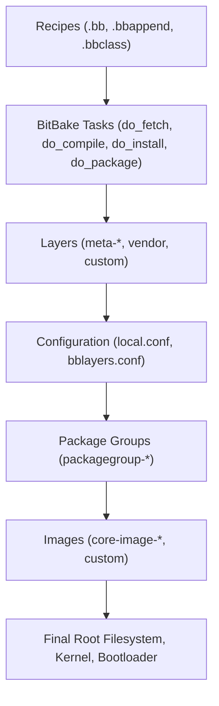
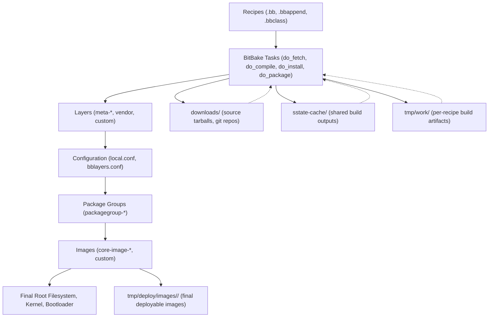

# 4. Anatomy of Yocto  

Understanding the anatomy of the Yocto Project is essential for customizing builds, adding new packages, and debugging build processes. This chapter breaks down the core components and how they interact.  

---

## 4.1 What is a Recipe (.bb, .bbappend, .bbclass)?  

- **`.bb` (BitBake recipe)**  
  Defines how to fetch, configure, compile, and install a piece of software.  
  Example: `foo_1.0.bb` builds version 1.0 of package `foo`.  

- **`.bbappend` (append file)**  
  Extends or modifies an existing recipe without duplicating it. Useful for board/vendor-specific customizations.  
  Example: `foo_1.0.bbappend` might add extra patches for `foo` on ARM machines.  

- **`.bbclass` (class file)**  
  Encapsulates reusable logic and tasks that multiple recipes can inherit.  
  Example: `cmake.bbclass` provides standardized handling for CMake-based projects.  

---

## 4.2 Tasks and Variables (do_compile, do_install)  

- **Tasks**: Predefined build steps in BitBake.  
  Common tasks include:  
  - `do_fetch` → Download source code.  
  - `do_unpack` → Extract tarballs.  
  - `do_patch` → Apply patches.  
  - `do_configure` → Configure build system.  
  - `do_compile` → Compile the source.  
  - `do_install` → Install into a staging area.  
  - `do_package` → Generate binary packages (RPM, DEB, IPK).  

- **Variables**: Metadata controlling how tasks behave.  
  - `SRC_URI` → Where to fetch source.  
  - `DEPENDS` → Build-time dependencies.  
  - `RDEPENDS` → Runtime dependencies.  
  - `IMAGE_INSTALL` → Packages included in the root filesystem.  

---

## 4.3 Layers (meta-*) and Their Purpose  

Yocto uses **layers** to organize metadata:  

- **`meta/`** → Core metadata (provided by Poky).  
- **`meta-poky/`** → Poky distribution policies.  
- **`meta-oe/`** → OpenEmbedded extra packages.  
- **`meta-<vendor>/`** → Vendor-specific support (e.g., `meta-intel`, `meta-raspberrypi`).  
- **Custom Layers** → User-defined layers to add BSP (Board Support Packages), recipes, or policies.  

👉 Layers provide modularity, allowing developers to mix and match features across projects.  

---

## 4.4 Configuration Files (local.conf, bblayers.conf)  

- **`conf/local.conf`**  
  - Defines machine, distro, and build settings.  
  - Example: target architecture (`MACHINE = "qemux86-64"`) and image type (`IMAGE_FEATURES += "ssh-server-dropbear"`).  

- **`conf/bblayers.conf`**  
  - Lists which layers are included in the build.  
  - Example:  
    ```conf
    BBLAYERS ?= " \
      /home/user/poky/meta \
      /home/user/poky/meta-poky \
      /home/user/poky/meta-yocto-bsp \
    "
    ```  

---

## 4.5 Package Groups and Images  

- **Package Groups (`packagegroup-*`)**  
  - Virtual packages that pull in sets of related software.  
  - Example: `packagegroup-core-boot` → Minimal set of packages for a bootable system.  

- **Images (`core-image-*`)**  
  - Define what goes into the final root filesystem.  
  - Examples:  
    - `core-image-minimal` → Smallest bootable image.  
    - `core-image-sato` → Full-featured image with GUI.  
    - `custom-image.bb` → User-defined image with selected packages.  

---

## 📊 Visualizing Yocto Build Flow  





✅ By understanding recipes, tasks, layers, and configurations, developers can effectively **customize Yocto builds** to match their target hardware and application requirements.  
