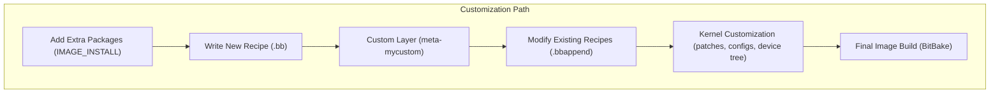

# 5. Customization

Yocto is designed to be flexible. Beyond simply building standard images, you can **add new software, modify existing recipes, or even change the kernel**. This chapter covers the most common customization tasks.

---

## 5.1 Adding Extra Packages to an Image

To add packages into an image, you can extend the `IMAGE_INSTALL` variable in your `local.conf` or a custom image recipe:

```bash
IMAGE_INSTALL:append = " nano vim htop "
```


- `IMAGE_INSTALL` → defines which packages are included in the final rootfs.  
- Using `:append` ensures you don’t overwrite the default values.  

✅ Example: Adding `nano`, `vim`, and `htop` into the image.

---

## 5.2 Creating a Custom Layer

Layers are modular collections of recipes. To create your own:

```bash
bitbake-layers create-layer ../meta-mycustom
bitbake-layers add-layer ../meta-mycustom
```

- Creates `meta-mycustom/` with `conf/layer.conf`.  
- Add it to your build using `bblayers.conf`.  
- Useful for maintaining your own recipes, patches, or configurations.

---

## 5.3 Writing a New Recipe from Scratch

A **recipe (`.bb`)** defines how to fetch, configure, build, and package software.  

Basic example (`hello.bb`):

```bash
SUMMARY = "Hello World Example"
LICENSE = "MIT"
SRC_URI = "https://example.com/hello-1.0.tar.gz"
S = "${WORKDIR}/hello-1.0"

do_compile() {
    oe_runmake
}

do_install() {
    install -d ${D}${bindir}
    install -m 0755 hello ${D}${bindir}
}
```


- `do_compile` → how to build.  
- `do_install` → how to stage files into the rootfs.  

---

## 5.4 Modifying an Existing Recipe (.bbappend)

Instead of rewriting a recipe, you can **extend it** using `.bbappend`.  

Example: Add extra dependencies to `busybox`:

```bash 
# File: busybox_%.bbappend
DEPENDS += " libm "
EXTRA_OECONF += " --enable-math "
```


- The `%` wildcard matches multiple recipe versions.  
- Keeps modifications separate from upstream, making upgrades easier.

---

## 5.5 Kernel Customization

The kernel can be customized by applying patches, changing configurations, or adjusting the device tree.

### Adding a Kernel Patch

```bash
SRC_URI += " file://fix-driver-bug.patch "
```


### Changing Kernel Config
```bash 
bitbake virtual/kernel -c menuconfig
```
- Saves changes in a `.cfg` fragment that you can include in your kernel recipe.

### Custom Device Tree
```bash
SRC_URI += " file://my-board.dts "
KERNEL_DEVICETREE = "my-board.dtb"
```
This allows custom hardware configurations and board support.
---

✅ **Summary**

- Add software → `IMAGE_INSTALL`.  
- Create your own layer for modular customization.  
- Write new recipes or extend existing ones with `.bbappend`.  
- Kernel tweaks via patches, configs, or custom device trees.  

Yocto’s modular design ensures your changes are **organized, reproducible, and maintainable**.



