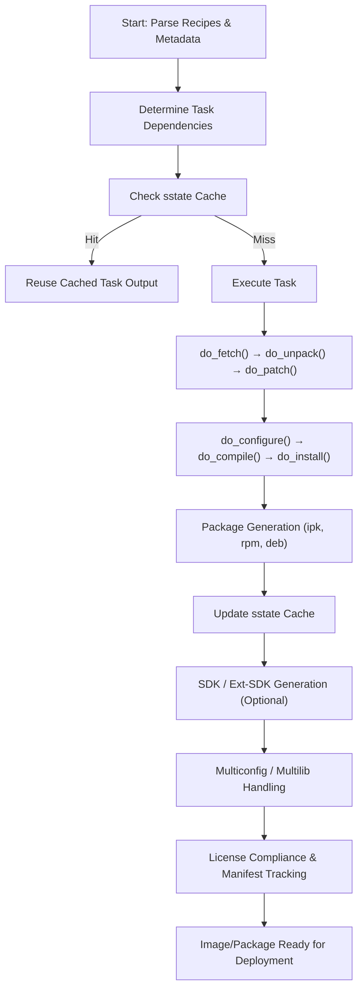

# 6. Advanced Concepts

Yocto provides powerful mechanisms beyond basic builds. This chapter covers advanced concepts that help developers optimize builds, manage dependencies, and ensure reproducibility.

## 6.1 BitBake Workflow in Detail
- **BitBake** is the core task executor in Yocto.
- Parses recipes (`.bb`, `.bbappend`) and metadata from layers.
- Determines task execution order, manages dependencies, and executes functions like `do_fetch()`, `do_compile()`, `do_install()`.
- Supports incremental builds and can skip tasks that are already up-to-date via **sstate cache**.

## 6.2 Shared State Cache (sstate) and Reproducibility
- **sstate-cache** stores pre-built artifacts for recipes.
- Enables **reproducible builds** and faster rebuilds.
- Helps share build outputs across projects or machines.
- Prevents recompiling unchanged tasks, saving significant time in large projects.

## 6.3 Yocto Package Formats (ipk, rpm, deb)
- Yocto supports multiple package formats for image generation:
  - **.ipk**: Lightweight package format for embedded systems.
  - **.rpm**: Red Hat Package Manager, compatible with RPM-based distributions.
  - **.deb**: Debian package format.
- Packages are generated automatically from installed files in `${D}` directories.

## 6.4 SDK and Ext-SDK: Developing Outside the Build System
- **SDK (Software Development Kit)** provides cross-compilation tools and headers to develop applications outside Yocto.
- **Ext-SDK** allows building multiple packages without rebuilding the full image.
- Useful for faster application development and testing.

## 6.5 Multiconfig and Multilib Builds
- **Multiconfig**: Enables building multiple images or targets in one invocation.
- **Multilib**: Supports building packages for multiple ABIs (e.g., 32-bit and 64-bit) simultaneously.
- Useful for supporting heterogeneous embedded platforms.

## 6.6 License Compliance and Manifest Tracking
- Yocto tracks licenses and generates **manifest files** for compliance.
- Ensures that all third-party components used in the image adhere to open-source licensing requirements.
- Helps in auditing and legal compliance for commercial products.
### Diagram shows the BitBake workflow, sstate cache interactions
